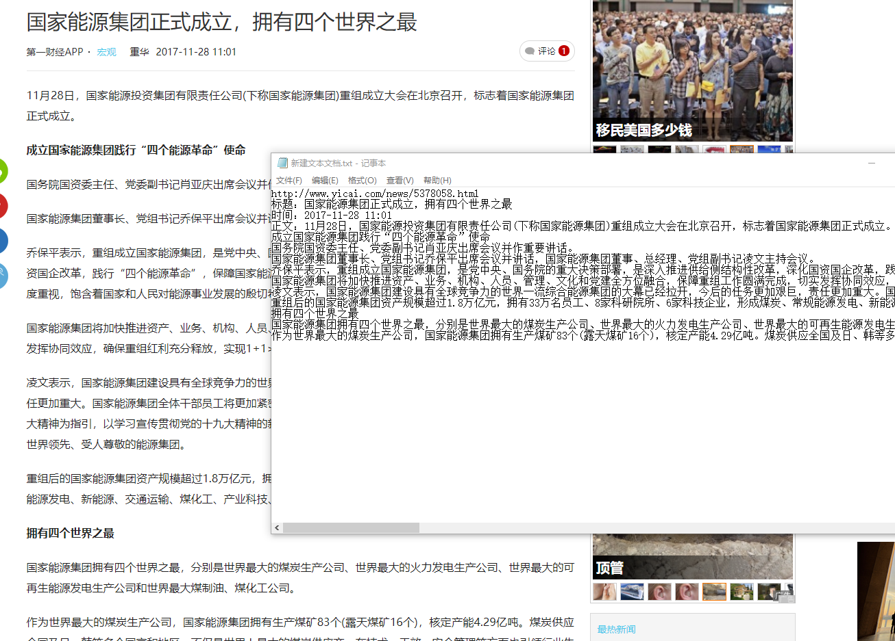

# extract_news

## Getting started

### Requirements

You need to have a 3.6 version of Python installed. See the  [page](https://www.python.org/) for more information.

### Installation

* python setup.py install
1. online extract

```
import extract_news
res = extract_news.online_parse(url)
# 获取新闻正文
news_content = res.get('news_content')
# 获取新闻发布时间
news_pubtime = res.get('news_pubtime')
# 获取新闻标题
news_title = res.get('news_title')
```

2. offline extract
```
# html为新闻网页字符串
res = extract_news.offline_parse(html)
```
### Questions, comments?
Send them to [He Chen](mailto:hee0624@163.com).
